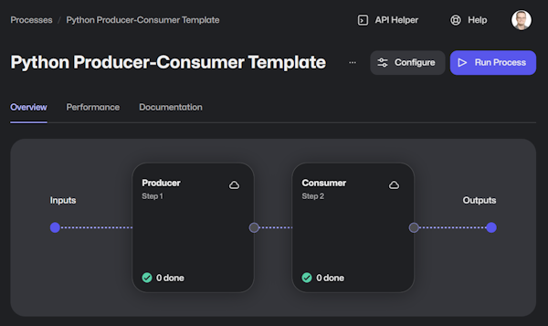

# Template: Python - Producer-Consumer

This template leverages the new [Python framework](https://github.com/robocorp/robocorp), the [libraries](https://github.com/robocorp/robocorp/blob/master/docs/README.md#python-libraries) from to same project as well.

This template contains a working robot implementation that has the basic structure where the first part produces work items from an input and the second one consumes those newly created output work items.



The template tries to keep the amount of functional code at a minimum so you have less to clear out and replace with your own implementation, but some functional logic is needed to have the template working and guiding the key parts.

> We recommended checking out the article "[Using work items](https://robocorp.com/docs/development-guide/control-room/work-items)" before diving in.

## Tasks

The robot is split into two tasks, meant to run as separate steps in Control Room. The first task generates (produces) data, and the second one reads (consumes) and processes that data.

### The first task (the producer)

- Load the example Excel file from work item
- Split the Excel file into work items for the consumer

### The second task (the consumer)

> We recommended checking out the article "[Work item exception handling](https://robocorp.com/docs/development-guide/control-room/work-items#work-item-exception-handling)" before diving in.

- Loop through all work items in the queue and access the payloads from the previous step

## Local testing

For best experience to test the work items in this example we recommend using [Robocorp Code -extensions for VS Code](https://robocorp.com/docs/developer-tools/visual-studio-code/extension-features). With the Robocorp Code extension you can simply run and [select the input work items](https://robocorp.com/docs/developer-tools/visual-studio-code/extension-features#using-work-items) to use, create inputs to simulate error cases, and so on.

## Extending the template

> The [producer-consumer](https://en.wikipedia.org/wiki/Producer%E2%80%93consumer_problem) model is not limited to two steps, it can continue so that the consumer generates further work items for the next step and so on.

Here's how you can add a third step, let's say a **reporter**, which will collect inputs from the previous one (the **consumer**) and generate a simple report with the previously created data. But first, see below what you need to add extra:

### The `reporter` step code

```python
@task
def reporter():
    """Collect and combine all the consumer outputs into a single report."""
    complete_orders = sum("complete" in item.payload["Order"] for item in workitems.inputs)
    print(f"Complete orders: {complete_orders}")
```

And as you can see, we collect some `"Order"` info from the previously created outputs, but we don't have yet such outputs created in the previous step (the **consumer**), so let's create them:

```python
@task
def consumer():
    """Process all the produced input Work Items from the previous step."""
    for item in workitems.inputs:
        try:
            ...
            workitems.outputs.create(payload={"Order": f"{name} is complete"})
            item.done()
        except AssertionError as err:
            ...
```

The magic happens in this single line added right before the `item.done()` part: `workitems.outputs.create(payload={"Order": f"{name} is complete"})`. This creates a new output for every processed input with an `"Order"` field in the payload data. This is retrieved in the next step (**reporter**) through `item.payload["Order"]`.

### The `reporter` task entry

All good on the code side, but we need now to make this new task visible and runnable right in our [*robot.yaml*](./robot.yaml) configuration. So add this under `tasks:`:

```yaml
Reporter:
    shell: python -m robocorp.tasks run tasks.py -t reporter
```

Now you're good to go, just run the **consumer** again (so you'll have output items created), then run the newly introduced 3rd step called **reporter**.


----

🚀 Now, go get'em

Start writing Python and remember that the AI/LLM's out there are getting really good and creating Python code specifically.

👉 Try out [Robocorp ReMark 💬](https://chat.robocorp.com)

For more information, do not forget to check out the following:
- [Robocorp Documentation -site](https://robocorp.com/docs)
- [Portal for more examples](https://robocorp.com/portal)
- Follow our main [robocorp -repository](https://github.com/robocorp/robocorp) as it is the main location where we developed the libraries and the framework.